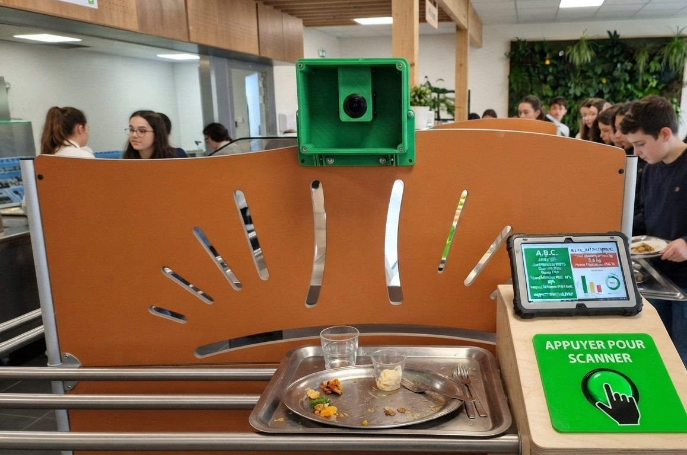

# E3D-cantine# 🥗 A.B.C. (Alimentation, Bilan, Carbone) - Collège Jean Giono

> **Dispositif innovant de lutte contre le gaspillage alimentaire et de pilotage de la cantine scolaire — Labellisé E3D Niveau 3.**

  

---

## 🎯 Présentation du Projet
L'application **A.B.C.** est un outil de suivi et de valorisation éco-citoyenne déployé au self du **Collège Jean Giono (Orange)**. Elle s'inscrit pleinement dans la démarche d'établissement en **Démarche de Développement Durable (E3D Niveau 3)**. 

L'objectif est double :
* **Sur le plan du terrain :** Mesurer et sensibiliser au gaspillage alimentaire grâce à une borne de scan interactive fabriquée par les élèves.
* **Sur le plan institutionnel :** Suivre les indicateurs de consommation et garantir la conformité des menus avec le plan alimentaire départemental (directives de Valérie Briançon, EGalim, CNRC).

---

## 🛠️ Innovation Pédagogique & Matériel (Conception Élèves)
Le dispositif de capture est le fruit d'une réalisation pratique et concrète menée avec les élèves :
* **Boîtier imprimé en 3D :** Fixé sur le haut des séparateurs orange caractéristiques de la ligne de tri du self.
* **Vision connectée :** Une caméra logée dans le boîtier pointe directement vers le rail où circulent les plateaux.
* **Ergonomie terrain :** Un **gros bouton d'arcade vert** permet à l'élève d'appuyer pour déclencher instantanément le scan (`"Appuyer pour scanner"`), garantissant une fiabilité absolue avant de vider son assiette dans les poubelles de tri dédiées.

---

## 📊 Architecture Technique
* **Front-end :** Interface web moderne avec effets de transparence (*Glassmorphism*), hébergée sur **GitHub Pages**.
* **Back-end & Stockage :** Centralisation de l'historique des menus et des logs d'analyse IA dans un **Google Sheet**.
* **Flux de données :** Saisie des déchets, calcul du bilan et édition automatisée des rapports institutionnels.

---

## 🚀 Fonctionnalités Clés
* **Espace Cuisinier / RAG :** Vérification des quotas stricts, des limitations de lipides, des produits frits et de la vigilance sur le soja.
* **Borne de Scan :** Suivi visuel et vocal en temps réel du taux d'adhésion réel et du pourcentage de déchets par plateau.
* **Bilan Institutionnel :** Synthèse automatisée du gaspillage global et des économies potentielles.

---
*Développé pour le Collège Jean Giono (Vaucluse)*
